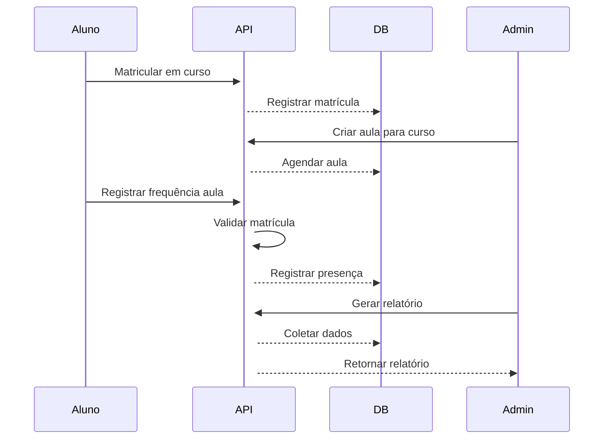

### ✅ **Arquitetura e Organização**
1. Criar novo arquivo `cursos_routes.py` na pasta de rotas
2. Importar dependências essenciais:
   ```python
   from fastapi import APIRouter, Depends, HTTPException
   from sqlalchemy.orm import Session
   from ..dependencies import pegar_sessao, verificar_token, verificar_admin
   from ..models.models import Curso, Matricula, Aula, Frequencia, Usuario
   ```
3. Configurar router principal:
   ```python
   cursos_router = APIRouter(
       prefix="/cursos",
       tags=["Cursos e Matrículas"],
       dependencies=[Depends(verificar_token)]
   )
   ```

### 📚 **Rotas para Cursos**
1. `POST /criar` - Criar novo curso (apenas admin)
2. `GET /listar` - Listar todos os cursos
3. `GET /{curso_id}/detalhes` - Detalhes de um curso específico

### 👥 **Rotas para Matrículas**
1. `POST /matricular` - Matricular aluno em curso:
   ```python
   @cursos_router.post("/matricular")
   async def matricular_aluno(usuario_id: int, curso_id: int, session: Session = Depends(pegar_sessao)):
       # Verificar se já está matriculado
       # Criar nova matrícula
   ```
2. `GET /{curso_id}/matriculas` - Listar matrículas de um curso

### 🎓 **Rotas para Aulas**
1. `POST /{curso_id}/aulas/criar` - Criar nova aula para um curso
2. `PATCH /aulas/{aula_id}/status` - Atualizar status da aula (cancelada/adiada)
3. `GET /{curso_id}/aulas` - Listar aulas de um curso

### 📝 **Rotas para Frequência**
1. `POST /frequencia/registrar` - Registrar presença:
   ```python
   async def registrar_frequencia(usuario_id: int, aula_id: int, session: Session = Depends(pegar_sessao)):
       # Validar se usuário está matriculado no curso da aula
       # Registrar frequência
   ```
2. `GET /aulas/{aula_id}/frequencias` - Listar frequências de uma aula

### 📊 **Rotas para Relatórios**
1. `GET /{curso_id}/relatorio/alunos` - Relatório de alunos no curso:
   ```python
   async def relatorio_alunos_curso(curso_id: int, session: Session = Depends(pegar_sessao)):
       # Quantidade de alunos
       # Lista de presenças
   ```
2. `GET /relatorios/matriculas` - Relatório de matrículas por período
3. `GET /alunos/{usuario_id}/perfil` - Perfil do aluno com histórico

### 🛡️ **Validações Cruciais**
1. Função para verificar matrícula antes de registrar frequência:
   ```python
   def verificar_matricula(usuario_id, aula_id, session):
       aula = session.get(Aula, aula_id)
       matricula = session.query(Matricula).filter_by(
           usuario_id=usuario_id,
           curso_id=aula.curso_id
       ).first()
       if not matricula:
           raise HTTPException(403, "Aluno não matriculado")
   ```
2. Validar status da aula antes de registrar presença

### 📦 **Schemas Pydantic (em schemas.py)**
1. Criar schemas para:
   - `CursoCreate`
   - `AulaCreate`
   - `FrequenciaRegister`
   - `RelatorioResponse`

### 🔐 **Controle de Acesso**
1. Proteger rotas críticas com `dependencies=[Depends(verificar_admin)]`
2. Validar ownership nas operações de aluno

### 🔄 **Fluxo Principal**


### ⏱️ Prioridade de Implementação
1. Criação de cursos e aulas
2. Sistema de matrículas
3. Registro de frequência com validação
4. Relatórios básicos
5. Controles de status de aula
6. Relatórios avançados